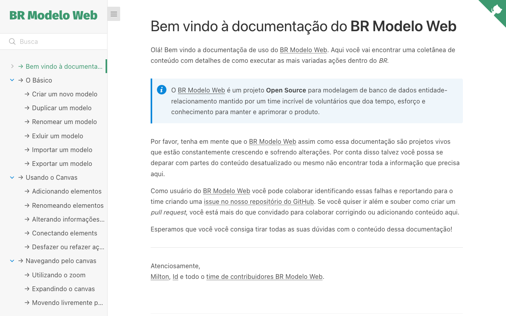

# BR Modelo Web documentation

[docs.brmodeloweb.com](https://docs.brmodeloweb.com)

This repository holds the oficial usage documentation of [BR Modelo Web](https://www.brmodeloweb.com) a open source web based tool to create database modeling.  

## Contribution

You're more than welcome to contribute to this docs by fixing erros, adding content or translations. Please take a look in the [contribution guidelines](#) (Contribution guidelines still pending) before submit your pull request.

## Dependencies

- [EditorConfig](https://editorconfig.org/)
- [Node.js](https://nodejs.org/) (Strongly recommended to install it via [nvm](https://github.com/nvm-sh/nvm#readme) or [n](https://github.com/tj/n#readme))
- [Yarn](https://yarnpkg.com/)

## Running application

1. Install dependencies: `yarn install`
1. Start the app: `yarn start`