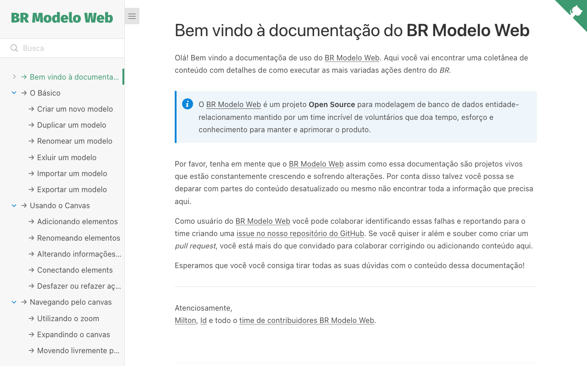

# BR Modelo Web documentation

[docs.brmodeloweb.com](https://docs.brmodeloweb.com)

This repository holds the oficial usage documentation of [BR Modelo Web](https://www.brmodeloweb.com) a open source web based tool to create database modeling.  

## Contribution

You're more than welcome to contribute to this docs by fixing erros, adding content or translations. Please take a look in the [contribution guidelines](#) (Contribution guidelines still pending) before submit your pull request.

## Dependencies

- [EditorConfig](https://editorconfig.org/)
- [Node.js](https://nodejs.org/) (Strongly recommended to install it via [nvm](https://github.com/nvm-sh/nvm#readme) or [n](https://github.com/tj/n#readme))
- [Yarn](https://yarnpkg.com/)

## Running application

This documentation is built with [VitePress](https://vitepress.dev). The markdown content lives in the `docs/` folder.

1. Install dependencies: `yarn install`
1. Start the dev server: `yarn start` (alias for `yarn docs:dev`)
1. Build for production: `yarn docs:build` (output in `docs/.vitepress/dist`)
1. Preview the production build: `yarn docs:preview`

## Deployment

The site is deployed to GitHub Pages by the [`deploy-docs`](.github/workflows/deploy-docs.yml) GitHub Actions workflow on every push to `main`.