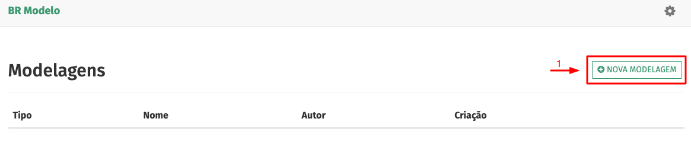
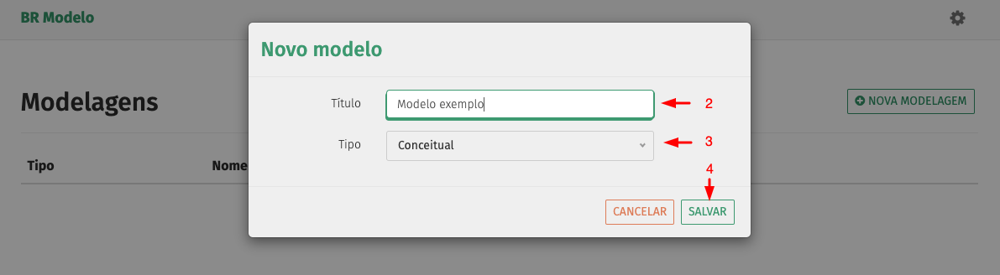
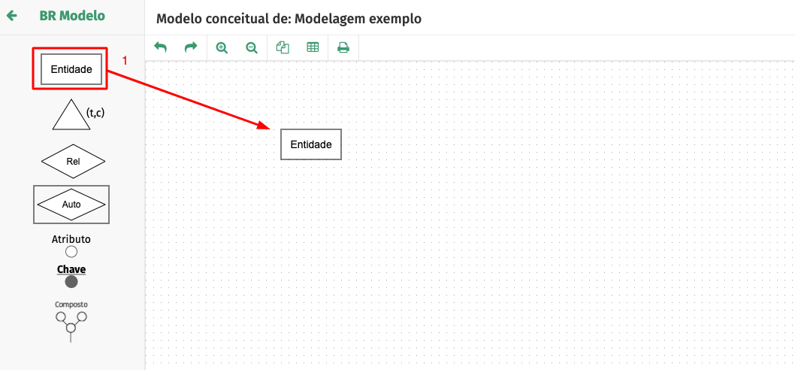

<!-- TODO: Update with your values. -->
# Tutoriais brmodeloweb
> Starter template for a Markdown-based docs site

 <!-- TODO: Update repo links and change license type if needed. -->
[](https://GitHub.com/MichaelCurrin/docsify-js-template/tags/)
[](https://github.com/MichaelCurrin/docsify-js-template/blob/master/README#license)
[](https://docsify.js.org/)


<!-- TODO: You can delete the About and Create a Docsify site sections if you create a new project from this template -->

## Criar modelagem conceitual

1. Pressione o botão `NOVA MODELAGEM`

<div align="center">
    
</div>

2. Preencha o campo `Título` 
3. Selecione a tipo `Conceitual` 
4. Pressione o botão `SALVAR` 

<div align="center">
    
</div>

<br>

## Incluir elementos no canvas

1. Arraste o elemento para área de modelagem

<div align="center">
    
</div>

<br>

## Como conectar elementos

_TODO: Add your instructions here or link to a usage.md page._

<br>

## Alterar nome dos elementos

_TODO: Add your instructions here or link to a usage.md page._

<br>

## Alterar nome dos elementos

_TODO: Add your instructions here or link to a usage.md page._

<br>


## Demo

This section showcases some functionality of Docsify.

```bash
echo "Hello, World"
```

> Sample quote

?> Sample hint

!> Sample warning 